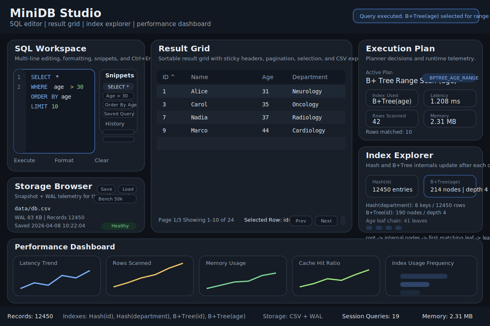
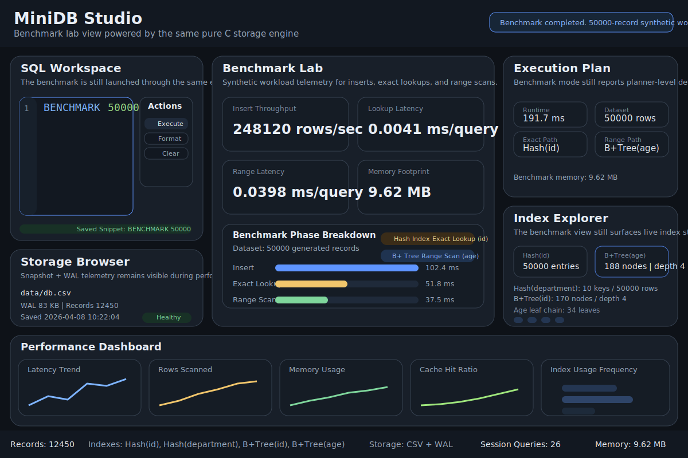
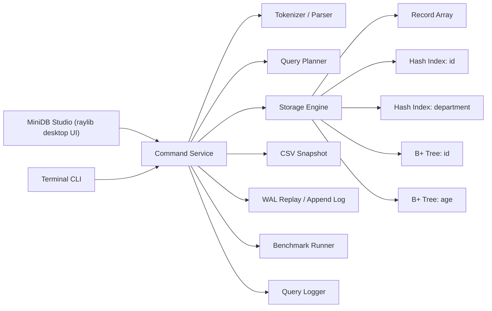

# c-mini-db-engine

[English](README.md) | [한국어](README.ko.md) | [日本語](README.ja.md)

`c-mini-db-engine` は現在、2 層構成のポートフォリオプロジェクトです。

- 再利用可能な純粋 C11 ストレージエンジン
- raylib で構築したネイティブデスクトップクライアント `MiniDB Studio`

ストレージエンジンは今も難しい部分を担っています。パース、CRUD、B+ Tree インデックス、WAL リプレイ、クエリプランニング、CSV 永続化、ベンチマーク実行はすべてエンジン側にあり、デスクトップ UI はそのストレージロジックを作り直さず、エンジン API を呼び出す独立したプレゼンテーション層として分離されています。

直近のデスクトップ強化では、このアプリは単なるコマンドランチャーではなく、スタジオ型ワークフローへ進化しました。複数行 SQL 編集、保存可能なスニペット、プロ仕様の結果グリッド、視覚的インデックスエクスプローラー、ストレージブラウザー、ライブパフォーマンスダッシュボードが、同じ純粋 C コアの上に載っています。

## Desktop Preview





## v4 で変わったこと

- 左側のコマンド領域を本格的な SQL ワークスペースにアップグレードしました。
  - 複数行編集
  - シンタックスハイライト風レンダリング
  - クリック可能な履歴
  - ディスクに保存される再利用可能なスニペット
  - `Ctrl+Enter` 実行
  - 整形 / クリア操作
- 中央の結果ビューをスタジオ風のデータグリッドへ拡張しました。
  - 固定ヘッダー
  - カラムソート
  - ページネーション
  - 選択行ハイライト
  - CSV エクスポート
  - 自動カラム幅
- `Hash(id)` と `B+Tree(age)` の視覚的インデックスエクスプローラーを追加しました。
- クエリ遅延、走査行数、メモリ使用量、キャッシュ比率、インデックス利用頻度を表示するライブパフォーマンスダッシュボードを追加しました。
- スナップショットパス、WAL サイズ、レコード数、最終保存時刻、ストレージ状態を示すストレージブラウザーを追加しました。
- 純粋 C エンジンと UI 非依存の executor 境界はそのまま維持しています。

## なぜポートフォリオとして強いのか

このプロジェクトは、単なるターミナルのおもちゃではなく、C で書かれた軽量データベーススタジオとして見える段階に来ています。次の要素をまとめて示せます。

- 低レベルのエンジン設計
- データ構造実装
- ストレージエンジン風の durability と indexing
- UI 分離とアプリケーションのレイヤリング
- 純粋 C によるネイティブデスクトップツール

3 分程度の面接説明で伝えられるほどコンパクトでありながら、システムプロジェクトとしてデモするには十分に豊富です。

## 機能概要

### Engine

- Pure C11
- 動的 in-memory レコードストレージ
- SQL ライクなパーサー
- CRUD 操作
- `id` と `department` 用のハッシュインデックス
- `id` と `age` 用の B+ Tree インデックス
- Range scan と ordered traversal
- Lightweight query optimizer
- `data/db.log` への WAL スタイルログ
- `data/db.csv` への CSV スナップショット
- クエリ時間計測とベンチマークモード

### Desktop UI

- `MiniDB Studio` というタイトルのネイティブ raylib ウィンドウ
- デフォルト `1200x800` のリサイズ可能レイアウト
- 丸みのあるカードと控えめなボーダーを持つダーク開発者テーマ
- 複数行編集、整形、スニペット保存に対応した SQL ワークスペース
- `data/snippets.txt` によるスニペット永続化
- クリック可能なクエリ履歴サイドバー
- ソート、ページネーション、選択、CSV エクスポートに対応したプロ仕様の結果グリッド
- 実行計画インスペクターと視覚的インデックスエクスプローラー
- CSV と WAL の状態を確認できるストレージブラウザー
- 下部のパフォーマンスダッシュボードと常時表示のエンジンステータスバー

## アーキテクチャ



### レイヤリングルール

- Engine layer
  - parser
  - planner
  - storage
  - persistence
  - benchmark
- UI layer
  - terminal renderer
  - desktop renderer

デスクトップアプリはストレージロジックを所有しません。コマンドを送信し、エンジンサービスが返す構造化結果を描画するだけです。

## Desktop Layout

`MiniDB Studio` は、ウィンドウ内のクエリ入力欄というより、軽量な DB 管理ツールに近い体験になっています。

### Left Panel

- 複数行 SQL エディタ
- シンタックスハイライト風トークンレンダリング
- 実行 / 整形 / クリア操作
- ディスク永続化されたカスタムスニペット棚
- クリック可能な最近のクエリ履歴

### Center Panel

- `SELECT` 用の結果グリッド
- `BENCHMARK` 用のベンチマークラボ
- `COUNT` 用の集計カード
- 結果セットがないときのヘルプ / empty state ビュー

### Right Panel

- 実行計画インスペクター
- optimizer path
- 使用されたインデックス
- 走査行数
- レイテンシ
- メモリ使用量
- コンパクトな視覚的インデックスエクスプローラー

### Left Lower Panel

- 読み込まれた CSV パス
- WAL サイズ
- レコード数
- 最終保存時刻
- ストレージ状態
- save / load / benchmark アクション

### Bottom Dashboard

- レイテンシ推移
- 走査行数推移
- メモリ使用量推移
- キャッシュヒット率
- インデックス使用頻度

### Bottom Status Bar

- 総レコード数
- 読み込まれたインデックス
- ストレージバックエンド
- セッションクエリ数
- メモリフットプリント

## GIF-Ready Showcase

短い画面録画でも映えるようにリポジトリを構成しています。

1. `MiniDB Studio` を起動する
2. `Load` をクリックする
3. `SELECT WHERE age > 30 ORDER BY age LIMIT 10` を実行する
4. 結果グリッド、実行インスペクター、インデックスエクスプローラーが一緒に更新される様子を見せる
5. `Save Current Query` をクリックしてスニペット棚に保存する
6. `Benchmark 50k` を実行する
7. ベンチマークラボ、パフォーマンスダッシュボード、ステータスバーを順に見せる

この流れなら 30 秒未満で UI の完成度とエンジン内部の両方を強調できます。

## ビルドと実行

### Raylib Requirement

デスクトップビルドでは、次のような構成で raylib が利用可能であることを前提としています。

```text
<raylib-root>/
|-- include/
|   `-- raylib.h
`-- lib/
    |-- libraylib.a
    `-- raylib.lib
```

`RAYLIB_DIR` を設定するか、`-RaylibDir` を渡してください。

### PowerShell

```powershell
$env:RAYLIB_DIR = "C:\raylib"
./build.ps1
./build.ps1 -Run
```

デフォルト出力:

```text
build/c-mini-db-studio.exe
```

CLI ビルド:

```powershell
./build.ps1 -Target cli
```

### Make

```bash
make studio RAYLIB_DIR=/path/to/raylib
make run RAYLIB_DIR=/path/to/raylib
make cli
```

### VSCode

デフォルトタスクは現在、デスクトップアプリを対象にしています。

- `build MiniDB Studio`
- `run MiniDB Studio`
- `build c-mini-db-engine CLI`
- `run c-mini-db-engine CLI`

## デスクトップ使用例

### UI から操作する場合

- `SELECT *` を入力して `Execute` を押す
- `Ctrl+Enter` で現在のエディタ内容を実行する
- `Save Current Query` を押して現在のクエリをスニペットとして保存する
- アプリを再起動しても `data/snippets.txt` から同じカスタムスニペットを再利用できる
- `Load` を押して `data/db.csv` と WAL を一緒に復元する
- `Save` を押して現在のスナップショットをチェックポイントする
- `Export CSV` を押して現在のグリッドを `data/export_result.csv` に保存する
- `Benchmark 50k` を押してベンチマークラボを開く

### サンプルクエリ

```text
INSERT 1 Alice 29 Oncology
INSERT 2 "Bob Stone" 41 Cardiology
INSERT 3 Carol 35 Oncology

SELECT WHERE age > 30 AND department = Oncology ORDER BY age LIMIT 10
SELECT ORDER BY age LIMIT 10
COUNT WHERE age > 30 OR department = Cardiology

UPDATE id=1 age=31 department=Neurology
DELETE id=2

SAVE
LOAD
BENCHMARK 100000
```

## プロジェクト構成

```text
c-mini-db-engine/
|-- include/
|   |-- benchmark.h
|   |-- bptree.h
|   |-- common.h
|   |-- database.h
|   |-- executor.h
|   |-- history.h
|   |-- index.h
|   |-- logger.h
|   |-- parser.h
|   |-- persistence.h
|   |-- planner.h
|   |-- studio_app.h
|   |-- timer.h
|   |-- ui.h
|   `-- wal.h
|-- src/
|   |-- benchmark.c
|   |-- bptree.c
|   |-- common.c
|   |-- database.c
|   |-- executor.c
|   |-- history.c
|   |-- index.c
|   |-- logger.c
|   |-- main.c
|   |-- parser.c
|   |-- persistence.c
|   |-- planner.c
|   |-- studio_app.c
|   |-- studio_main.c
|   |-- timer.c
|   |-- ui.c
|   `-- wal.c
|-- docs/
|   |-- studio-benchmark.svg
|   `-- studio-overview.svg
|-- data/
|   |-- db.csv
|   |-- db.log
|   |-- snippets.txt
|   `-- query.log
|-- tests/
|   |-- run_smoke.ps1
|   `-- smoke_commands.txt
|-- .vscode/
|   |-- extensions.json
|   `-- tasks.json
|-- build.ps1
|-- Makefile
|-- README.md
|-- README.ko.md
`-- README.ja.md
```

## ストレージエンジン設計

このプロジェクトの中心は依然としてストレージエンジンです。

- レコードはヒープ確保された `Record*` を持つ動的配列に格納されます
- 削除は swap-with-last compaction を使い、参照後の行削除を `O(1)` に抑えます
- ハッシュインデックスは高速な exact match を担当します
- B+ Tree は range scan と ordered traversal を担当します
- CSV スナップショットと WAL リプレイが軽量な復旧モデルを構成します

### 例のスキーマ

- `id` (`int`)
- `name` (`char[50]`)
- `age` (`int`)
- `department` (`char[50]`)

## Query Planner Strategy

Optimizer は意図的に lightweight で、面接で説明しやすい形に保っています。

### ヒューリスティック順序

1. `OR` predicate は full scan へフォールバック
2. `id = ...` は hash index を優先
3. `age` range は `age` B+ Tree を使用
4. `id` range は `id` B+ Tree を使用
5. `department = ...` は department hash index を使用
6. `ORDER BY age` または `ORDER BY id` は ordered B+ Tree traversal を使用
7. それ以外は full scan を使用

### サンプルプラン

| Query | Execution Plan |
|---|---|
| `SELECT WHERE id = 42` | `Hash Index Exact Lookup (id)` |
| `SELECT WHERE department = Oncology` | `Hash Index Exact Lookup (department)` |
| `SELECT WHERE age > 30` | `B+ Tree Range Scan (age)` |
| `SELECT ORDER BY age LIMIT 10` | `B+ Tree Ordered Traversal (age)` |
| `SELECT WHERE age > 30 OR department = Oncology` | `Full Table Scan` |

## B+ Tree Notes

2 本の B+ Tree を維持しています。

- `id`
- `age`

`age` ツリーは linked value list によって duplicate key を扱い、leaf node は ordered traversal のために連結されています。そのため最良ケースでは full in-memory sort を行わずに次のクエリを処理できます。

- `SELECT WHERE age > 30`
- `ORDER BY age`
- `ORDER BY age LIMIT 10`

## WAL と永続化

エンジンは次の 2 つを使います。

- `data/db.csv` をスナップショットとして利用
- `data/db.log` を WAL スタイル操作ログとして利用

### Write Path

- `INSERT`, `UPDATE`, `DELETE` がメモリ上の状態を更新する
- 成功した書き込みは WAL に操作レコードを append する

### Load Path

1. CSV スナップショットを一時データベースへ読み込む
2. その一時データベースに WAL をリプレイする
3. 復旧済みデータベースを live context に差し替える

この流れにより、復旧ロジックは明示的で追いやすいまま保たれます。

## メモリ所有権

両 UI モードで ownership は明確に保たれています。

- `Database` はレコード、インデックス、B+ Tree を所有する
- `History` は複製した command string を所有する
- `QueryResult` は一時的な row pointer buffer だけを所有する
- `CommandExecutionSummary` は UI が live result set を保持する間、その result buffer を所有する
- UI layer はデータを描画するが、エンジンストレージ自体は所有しない

そのため後始末も単純です。

- terminal mode は各ループで summary を破棄する
- desktop mode は新しいコマンドが前の結果を置き換えるとき、または終了時に active summary を破棄する

## 計算量

| Operation | Complexity | Primary Path |
|---|---|---|
| Insert | `O(1) + O(log n)` | append row + index maintenance |
| Exact `id = ...` lookup | `O(1)` | hash index |
| Exact `department = ...` lookup | `O(1 + k)` | hash bucket + matching list |
| Exact `age = ...` lookup | `O(log n + k)` | age B+ Tree |
| Range `age > ...` | `O(log n + k)` | age B+ Tree |
| `ORDER BY age LIMIT m` | `O(log n + m)` | age B+ Tree traversal |
| Full scan | `O(n)` | record array |
| Save snapshot | `O(n)` | CSV write |
| Load + replay | `O(n + w log n)` | snapshot load + WAL replay |

## Benchmark Mode

`BENCHMARK <record_count>` は今も実際のエンジン上で動作しますが、デスクトップアプリでは平文の代わりにスタジオ型 benchmark lab として結果を描画します。

主なメトリクス:

- insert throughput
- exact lookup latency
- range scan latency
- memory usage
- best exact lookup path
- best range scan path

## Terminal Mode も維持

ターミナルアプリケーションはスモークテストや、エンジン中心のデモ用として引き続き利用できます。

```powershell
./build.ps1 -Target cli -Run
```

その結果、このプロジェクトは 2 つの見せ方を持ちます。

- デスクトップモード: ポートフォリオの見栄え用
- CLI モード: デバッグや簡易自動実行用

## Smoke Test

```powershell
./tests/run_smoke.ps1
```

このスモークスクリプトは今も次の流れをカバーします。

- compound predicates
- ordered traversal
- limit pushdown
- WAL replay
- benchmark mode

## 3 分面接ピッチ

`c-mini-db-engine` は純粋 C のストレージエンジンと、分離されたネイティブデスクトップフロントエンドを組み合わせたプロジェクトです。エンジンはメモリ上に row を保持し、exact match には hash index、ordered / range query には B+ Tree を使い、lightweight optimizer が最適な実行計画を選択します。永続化は CSV snapshot と WAL スタイルログに分かれており、復旧ではまず一時データベースへ読み込んでから live state を差し替えるため安全です。その上に `MiniDB Studio` が raylib ベースの SQL ワークスペース、結果グリッド、実行インスペクター、インデックスエクスプローラー、ストレージブラウザー、パフォーマンスダッシュボードを提供し、3 分で説明できる一方で、軽量デスクトップ DB ツールのように見えるポートフォリオに仕上がっています。
