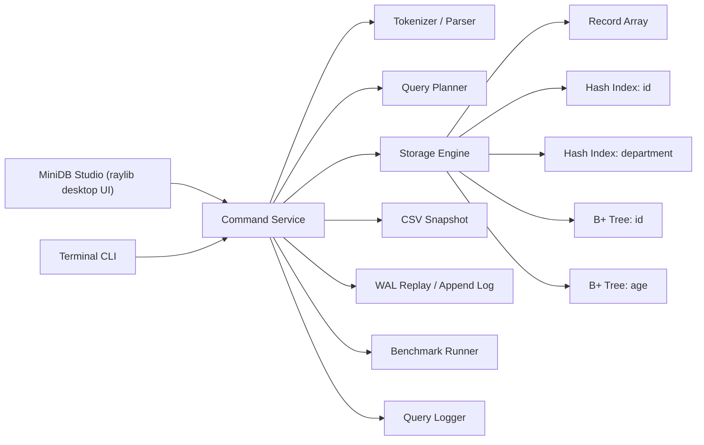

# c-mini-db-engine

[English](README.md) | [한국어](README.ko.md) | [日本語](README.ja.md)

`c-mini-db-engine`는 이제 두 개의 계층으로 구성된 포트폴리오 프로젝트입니다.

- 재사용 가능한 순수 C11 스토리지 엔진
- raylib로 만든 네이티브 데스크톱 클라이언트 `MiniDB Studio`

스토리지 엔진은 여전히 핵심 난제를 담당합니다. 파싱, CRUD, B+ Tree 인덱싱, WAL 재생, 쿼리 플래닝, CSV 영속화, 벤치마크 실행이 모두 엔진 안에 있고, 데스크톱 UI는 이 로직을 다시 구현하지 않고 엔진 API를 호출하는 별도 프레젠테이션 계층으로 분리되어 있습니다.

최근 데스크톱 고도화 단계에서는 앱이 단일 명령 실행기 수준을 넘어서 스튜디오형 워크플로우로 발전했습니다. 멀티라인 SQL 편집, 저장 가능한 스니펫, 전문적인 결과 그리드, 시각적 인덱스 탐색기, 스토리지 브라우저, 실시간 성능 대시보드가 모두 동일한 순수 C 코어 위에 올라갑니다.

## Desktop Preview


## v4에서 달라진 점

- 좌측 명령 영역을 실제 SQL 워크스페이스로 업그레이드했습니다.
  - 멀티라인 편집
  - 문법 강조 스타일 렌더링
  - 클릭 가능한 히스토리
  - 디스크에 저장되는 재사용 가능한 스니펫
  - `Ctrl+Enter` 실행
  - 포맷 / 지우기 액션
- 중앙 결과 뷰를 스튜디오 스타일 데이터 그리드로 확장했습니다.
  - 고정 헤더
  - 컬럼 정렬
  - 페이지네이션
  - 선택 행 하이라이트
  - CSV 내보내기
  - 자동 컬럼 너비
- `Hash(id)`와 `B+Tree(age)`에 대한 시각적 인덱스 탐색기를 추가했습니다.
- 쿼리 지연 시간, 스캔 행 수, 메모리 사용량, 캐시 비율, 인덱스 사용 빈도를 보여 주는 실시간 성능 대시보드를 추가했습니다.
- 스냅샷 경로, WAL 크기, 레코드 수, 마지막 저장 시각, 스토리지 상태를 보여 주는 스토리지 브라우저를 추가했습니다.
- 순수 C 엔진과 UI 중립적인 executor 경계를 그대로 유지했습니다.

## 이 프로젝트가 돋보이는 이유

이 프로젝트는 이제 단순한 터미널 장난감이 아니라, C로 만든 가벼운 데이터베이스 스튜디오처럼 보입니다. 다음 요소를 함께 보여 줍니다.

- 저수준 엔진 설계
- 자료구조 구현
- 스토리지 엔진 스타일의 durability와 indexing
- UI 분리와 애플리케이션 계층화
- 순수 C 기반 네이티브 데스크톱 툴링

3분 정도의 면접 설명으로도 전달 가능할 만큼 컴팩트하지만, 시스템 프로젝트로 데모하기에는 충분히 풍부합니다.

## 기능 요약

### Engine

- Pure C11
- 동적 in-memory 레코드 저장소
- SQL 유사 파서
- CRUD 연산
- `id`, `department`용 해시 인덱스
- `id`, `age`용 B+ Tree 인덱스
- Range scan과 ordered traversal
- Lightweight query optimizer
- `data/db.log` 기반 WAL 스타일 로그
- `data/db.csv` 기반 CSV 스냅샷
- 쿼리 시간 측정과 벤치마크 모드

### Desktop UI

- `MiniDB Studio`라는 제목의 네이티브 raylib 윈도우
- 기본 `1200x800` 크기의 리사이즈 가능한 레이아웃
- 둥근 카드와 은은한 보더를 사용하는 다크 개발자 테마
- 멀티라인 편집, 포맷팅, 스니펫 저장을 지원하는 SQL 워크스페이스
- `data/snippets.txt`를 통한 스니펫 영속화
- 클릭 가능한 쿼리 히스토리 사이드바
- 정렬, 페이지네이션, 선택, CSV 내보내기를 지원하는 결과 그리드
- 실행 계획 인스펙터와 시각적 인덱스 탐색기
- CSV / WAL 상태를 보여 주는 스토리지 브라우저
- 하단 성능 대시보드와 지속 표시되는 엔진 상태 바

## 아키텍처



### 계층 분리 규칙

- Engine layer
  - parser
  - planner
  - storage
  - persistence
  - benchmark
- UI layer
  - terminal renderer
  - desktop renderer

데스크톱 앱은 스토리지 로직을 소유하지 않습니다. 명령을 제출하고, 엔진 서비스가 반환한 구조화된 결과를 렌더링만 합니다.

## Desktop Layout

`MiniDB Studio`는 이제 단순한 쿼리 입력 창이 아니라 경량 DB 관리 도구에 더 가까운 형태입니다.

### Left Panel

- 멀티라인 SQL 에디터
- 문법 강조 스타일 토큰 렌더링
- 실행 / 포맷 / 지우기 컨트롤
- 디스크에 저장되는 커스텀 스니펫 선반
- 클릭 가능한 최근 쿼리 히스토리

### Center Panel

- `SELECT`용 결과 그리드
- `BENCHMARK`용 벤치마크 랩
- `COUNT`용 집계 카드
- 결과가 없을 때 보여 주는 안내 / empty state 뷰

### Right Panel

- 실행 계획 인스펙터
- optimizer path
- 선택된 인덱스
- 스캔 행 수
- 지연 시간
- 메모리 사용량
- 컴팩트한 시각적 인덱스 탐색기

### Left Lower Panel

- 로드된 CSV 경로
- WAL 크기
- 레코드 수
- 마지막 저장 시각
- 스토리지 상태
- save / load / benchmark 액션

### Bottom Dashboard

- 지연 시간 추세
- 스캔 행 수 추세
- 메모리 사용량 추세
- 캐시 히트 비율
- 인덱스 사용 빈도

### Bottom Status Bar

- 전체 레코드 수
- 로드된 인덱스
- 스토리지 백엔드
- 세션 쿼리 수
- 메모리 사용량

## GIF-Ready Showcase

짧은 화면 녹화에서도 잘 보이도록 저장소가 구성되어 있습니다.

1. `MiniDB Studio`를 실행합니다.
2. `Load`를 클릭합니다.
3. `SELECT WHERE age > 30 ORDER BY age LIMIT 10`를 실행합니다.
4. 결과 그리드, 실행 인스펙터, 인덱스 탐색기가 함께 업데이트되는 모습을 보여 줍니다.
5. `Save Current Query`를 눌러 스니펫 선반에 쿼리를 저장합니다.
6. `Benchmark 50k`를 실행합니다.
7. 벤치마크 랩, 성능 대시보드, 상태 바를 차례로 보여 줍니다.

이 흐름이면 30초 안에 UI 완성도와 엔진 내부 구조를 함께 강조할 수 있습니다.

## 빌드 및 실행

### Raylib Requirement

데스크톱 빌드는 다음과 같은 디렉터리에 raylib이 준비되어 있다고 가정합니다.

```text
<raylib-root>/
|-- include/
|   `-- raylib.h
`-- lib/
    |-- libraylib.a
    `-- raylib.lib
```

`RAYLIB_DIR`을 설정하거나 `-RaylibDir`를 전달하면 됩니다.

### PowerShell

```powershell
$env:RAYLIB_DIR = "C:\raylib"
./build.ps1
./build.ps1 -Run
```

기본 출력:

```text
build/c-mini-db-studio.exe
```

CLI 빌드:

```powershell
./build.ps1 -Target cli
```

### Make

```bash
make studio RAYLIB_DIR=/path/to/raylib
make run RAYLIB_DIR=/path/to/raylib
make cli
```

### VSCode

기본 태스크는 이제 데스크톱 앱을 대상으로 합니다.

- `build MiniDB Studio`
- `run MiniDB Studio`
- `build c-mini-db-engine CLI`
- `run c-mini-db-engine CLI`

## 데스크톱 사용 예시

### UI에서 직접 사용

- `SELECT *`를 입력하고 `Execute`를 누릅니다.
- `Ctrl+Enter`로 현재 에디터 내용을 실행합니다.
- `Save Current Query`를 눌러 현재 쿼리를 스니펫으로 저장합니다.
- 앱을 다시 실행해도 `data/snippets.txt`에 저장된 스니펫을 재사용할 수 있습니다.
- `Load`를 눌러 `data/db.csv`와 WAL을 함께 복원합니다.
- `Save`를 눌러 현재 스냅샷을 체크포인트합니다.
- `Export CSV`를 눌러 현재 그리드를 `data/export_result.csv`로 저장합니다.
- `Benchmark 50k`를 눌러 벤치마크 랩을 엽니다.

### 샘플 쿼리

```text
INSERT 1 Alice 29 Oncology
INSERT 2 "Bob Stone" 41 Cardiology
INSERT 3 Carol 35 Oncology

SELECT WHERE age > 30 AND department = Oncology ORDER BY age LIMIT 10
SELECT ORDER BY age LIMIT 10
COUNT WHERE age > 30 OR department = Cardiology

UPDATE id=1 age=31 department=Neurology
DELETE id=2

SAVE
LOAD
BENCHMARK 100000
```

## 프로젝트 구조

```text
c-mini-db-engine/
|-- include/
|   |-- benchmark.h
|   |-- bptree.h
|   |-- common.h
|   |-- database.h
|   |-- executor.h
|   |-- history.h
|   |-- index.h
|   |-- logger.h
|   |-- parser.h
|   |-- persistence.h
|   |-- planner.h
|   |-- studio_app.h
|   |-- timer.h
|   |-- ui.h
|   `-- wal.h
|-- src/
|   |-- benchmark.c
|   |-- bptree.c
|   |-- common.c
|   |-- database.c
|   |-- executor.c
|   |-- history.c
|   |-- index.c
|   |-- logger.c
|   |-- main.c
|   |-- parser.c
|   |-- persistence.c
|   |-- planner.c
|   |-- studio_app.c
|   |-- studio_main.c
|   |-- timer.c
|   |-- ui.c
|   `-- wal.c
|-- docs/
|   |-- studio-benchmark.svg
|   `-- studio-overview.svg
|-- data/
|   |-- db.csv
|   |-- db.log
|   |-- snippets.txt
|   `-- query.log
|-- tests/
|   |-- run_smoke.ps1
|   `-- smoke_commands.txt
|-- .vscode/
|   |-- extensions.json
|   `-- tasks.json
|-- build.ps1
|-- Makefile
|-- README.md
`-- README.ko.md
```

## 스토리지 엔진 설계

이 프로젝트의 핵심은 여전히 스토리지 엔진입니다.

- 레코드는 힙에 할당된 `Record*`를 담는 동적 배열에 저장됩니다.
- 삭제는 조회 후 swap-with-last compaction을 사용해 `O(1)` 행 제거를 달성합니다.
- 해시 인덱스는 빠른 exact match를 담당합니다.
- B+ Tree는 range scan과 ordered traversal을 담당합니다.
- CSV 스냅샷과 WAL 재생이 경량 복구 모델을 구성합니다.

### 예시 스키마

- `id` (`int`)
- `name` (`char[50]`)
- `age` (`int`)
- `department` (`char[50]`)

## Query Planner 전략

Optimizer는 의도적으로 lightweight하고 면접에서 설명하기 쉬운 형태로 유지합니다.

### 휴리스틱 우선순위

1. `OR` predicate는 full scan으로 fallback
2. `id = ...`는 hash index를 우선 사용
3. `age` range는 `age` B+ Tree 사용
4. `id` range는 `id` B+ Tree 사용
5. `department = ...`는 department hash index 사용
6. `ORDER BY age` 또는 `ORDER BY id`는 ordered B+ Tree traversal 사용
7. 그 외는 full scan 사용

### 샘플 계획

| Query | Execution Plan |
|---|---|
| `SELECT WHERE id = 42` | `Hash Index Exact Lookup (id)` |
| `SELECT WHERE department = Oncology` | `Hash Index Exact Lookup (department)` |
| `SELECT WHERE age > 30` | `B+ Tree Range Scan (age)` |
| `SELECT ORDER BY age LIMIT 10` | `B+ Tree Ordered Traversal (age)` |
| `SELECT WHERE age > 30 OR department = Oncology` | `Full Table Scan` |

## B+ Tree Notes

두 개의 B+ Tree가 유지됩니다.

- `id`
- `age`

`age` 트리는 linked value list로 duplicate key를 지원하고, leaf node는 ordered traversal을 위해 서로 연결된 상태를 유지합니다. 그래서 최적 경로에서는 full in-memory sort 없이도 다음 쿼리를 효율적으로 지원할 수 있습니다.

- `SELECT WHERE age > 30`
- `ORDER BY age`
- `ORDER BY age LIMIT 10`

## WAL 및 영속화

엔진은 다음 두 파일을 사용합니다.

- `data/db.csv` 스냅샷
- `data/db.log` WAL 스타일 로그

### Write Path

- `INSERT`, `UPDATE`, `DELETE`가 메모리를 갱신합니다.
- 성공한 쓰기 연산은 WAL에 operation record를 append합니다.

### Load Path

1. CSV 스냅샷을 임시 데이터베이스에 로드합니다.
2. WAL을 그 임시 데이터베이스에 재생합니다.
3. 복구된 데이터베이스를 live context에 교체합니다.

이 흐름 덕분에 복구 로직이 명시적이고 이해하기 쉬운 상태로 유지됩니다.

## 메모리 소유권

두 UI 모드 모두에서 ownership은 명확하게 유지됩니다.

- `Database`는 레코드, 인덱스, B+ Tree를 소유합니다.
- `History`는 복제된 command string을 소유합니다.
- `QueryResult`는 임시 row pointer buffer만 소유합니다.
- `CommandExecutionSummary`는 UI가 live result set을 유지할 때 현재 result buffer를 소유합니다.
- UI layer는 데이터를 렌더링하지만 엔진 스토리지를 소유하지 않습니다.

그래서 정리 로직도 단순합니다.

- terminal 모드는 루프마다 summary를 파괴합니다.
- desktop 모드는 새 명령이 이전 결과를 대체할 때 또는 종료 시 active summary를 파괴합니다.

## 시간 복잡도

| Operation | Complexity | Primary Path |
|---|---|---|
| Insert | `O(1) + O(log n)` | append row + index maintenance |
| Exact `id = ...` lookup | `O(1)` | hash index |
| Exact `department = ...` lookup | `O(1 + k)` | hash bucket + matching list |
| Exact `age = ...` lookup | `O(log n + k)` | age B+ Tree |
| Range `age > ...` | `O(log n + k)` | age B+ Tree |
| `ORDER BY age LIMIT m` | `O(log n + m)` | age B+ Tree traversal |
| Full scan | `O(n)` | record array |
| Save snapshot | `O(n)` | CSV write |
| Load + replay | `O(n + w log n)` | snapshot load + WAL replay |

## Benchmark Mode

`BENCHMARK <record_count>`는 여전히 실제 엔진 위에서 실행되지만, 데스크톱 앱에서는 이제 평문 출력 대신 스튜디오형 benchmark lab으로 결과를 렌더링합니다.

대표적으로 다음 지표를 보여 줍니다.

- insert throughput
- exact lookup latency
- range scan latency
- memory usage
- best exact lookup path
- best range scan path

## Terminal Mode도 유지됨

터미널 애플리케이션도 스모크 테스트와 엔진 중심 데모를 위해 계속 제공됩니다.

```powershell
./build.ps1 -Target cli -Run
```

즉, 프로젝트는 두 가지 시연 모드를 동시에 가집니다.

- 데스크톱 모드: 포트폴리오 프레젠테이션용
- CLI 모드: 디버깅 및 간단한 자동 실행용

## Smoke Test

```powershell
./tests/run_smoke.ps1
```

스모크 스크립트는 여전히 다음 흐름을 다룹니다.

- compound predicate
- ordered traversal
- limit pushdown
- WAL replay
- benchmark mode

## 3분 면접 피치

`c-mini-db-engine`는 순수 C 스토리지 엔진과 별도 네이티브 데스크톱 프런트엔드를 결합한 프로젝트입니다. 엔진은 메모리에 row를 저장하고, exact match에는 hash index를, ordered / range query에는 B+ Tree를 사용하며, lightweight optimizer가 최적 실행 계획을 선택합니다. 영속화는 CSV snapshot과 WAL 스타일 로그로 분리되어 있고, 복구는 임시 데이터베이스에 먼저 로드한 뒤 live state를 교체하는 방식으로 안전하게 처리됩니다. 그 위에 `MiniDB Studio`가 raylib 기반 SQL 워크스페이스, 결과 그리드, 실행 인스펙터, 인덱스 탐색기, 스토리지 브라우저, 성능 대시보드를 제공해, 3분 안에 설명 가능하면서도 실제 경량 데스크톱 DB 툴처럼 보이는 포트폴리오 프로젝트가 됩니다.
