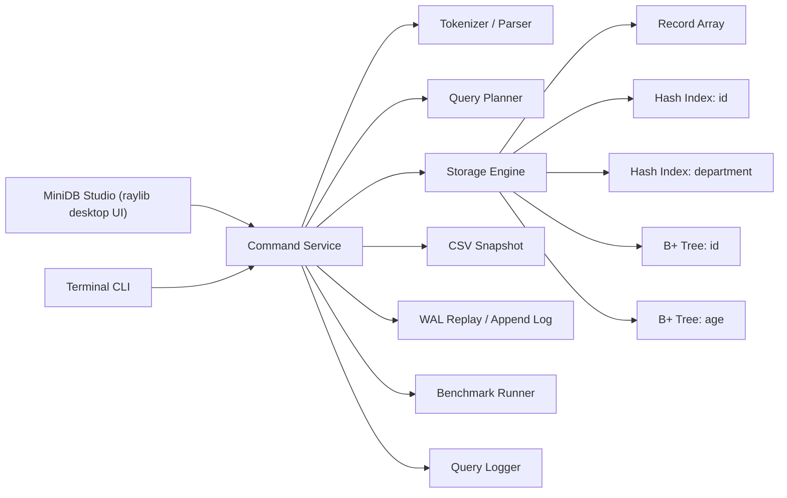

# c-mini-db-engine

[English](README.md) | [한국어](README.ko.md) | [日本語](README.ja.md)

`c-mini-db-engine` is now a two-layer portfolio project:

- a reusable pure C11 storage engine
- a native desktop client called `MiniDB Studio` built with raylib

The storage engine still owns the hard parts: parsing, CRUD, B+ Tree indexing, WAL replay, query planning, CSV persistence, and benchmark execution. The desktop UI is a separate presentation layer that calls those engine APIs without rewriting the storage logic.

The latest desktop pass turns the app into a studio-style workflow instead of a single-command launcher: multi-line SQL editing, saved snippets, a professional result grid, a visual index explorer, a storage browser, and a live performance dashboard all sit on top of the same pure C core.

## Desktop Preview


## What Changed In v4

- Upgraded the left command area into a real SQL workspace with:
  - multi-line editing
  - syntax-highlight-style rendering
  - clickable history
  - reusable saved snippets persisted to disk
  - `Ctrl+Enter` execution
  - format and clear actions
- Turned the center results view into a more studio-like data grid:
  - sticky header
  - column sorting
  - pagination
  - row selection highlight
  - CSV export
  - auto-sized columns
- Added a compact visual index explorer for `Hash(id)` and `B+Tree(age)`
- Added a live performance dashboard with query latency, rows scanned, memory usage, cache ratio, and index usage frequency
- Added a storage browser for snapshot path, WAL size, record count, last save time, and storage health
- Preserved the pure C engine and the UI-neutral executor boundary from the previous desktop release

## Why This Is Portfolio-Strong

This project now feels like a lightweight database studio written in C, not just a terminal toy. It shows:

- low-level engine design
- data structure implementation
- storage-engine style durability and indexing
- UI separation and application layering
- native desktop tooling in pure C

It is still compact enough to explain in a three-minute interview, but rich enough to demo as a systems project.

## Feature Summary

### Engine

- Pure C11
- Dynamic in-memory record storage
- SQL-like parser
- CRUD operations
- Hash indexes on `id` and `department`
- B+ Tree indexes on `id` and `age`
- Range scans and ordered traversal
- Lightweight query optimizer
- WAL-style logging to `data/db.log`
- CSV snapshots in `data/db.csv`
- Query timing and benchmark mode

### Desktop UI

- Native raylib window titled `MiniDB Studio`
- Default `1200x800` resizable layout
- Dark developer theme with rounded cards and subtle borders
- SQL workspace with multi-line editing, formatting, and snippet saving
- Snippet persistence via `data/snippets.txt`
- Clickable query history sidebar
- Professional result grid with sorting, pagination, selection, and CSV export
- Execution plan inspector plus visual index explorer
- Storage browser for CSV and WAL state
- Bottom performance dashboard and persistent engine status bar

## Architecture



### Layering Rule

- Engine layer:
  - parser
  - planner
  - storage
  - persistence
  - benchmark
- UI layer:
  - terminal renderer
  - desktop renderer

The desktop app does not own storage logic. It only submits commands and renders structured results returned by the engine service.

## Desktop Layout

`MiniDB Studio` now feels closer to a lightweight DB management tool than a query prompt in a window.

### Left Panel

- Multi-line SQL editor
- syntax-highlight-style token rendering
- execute / format / clear controls
- reusable snippet shelf with disk-backed custom snippets
- clickable recent query history

### Center Panel

- result grid for `SELECT`
- benchmark lab for `BENCHMARK`
- aggregate card for `COUNT`
- help / empty-state view when no result set is active

### Right Panel

- execution plan inspector
- optimizer path
- chosen index
- rows scanned
- latency
- memory usage
- compact visual index explorer

### Left Lower Panel

- loaded CSV path
- WAL size
- record count
- last save timestamp
- storage health
- save / load / benchmark actions

### Bottom Dashboard

- latency trend
- rows scanned trend
- memory usage trend
- cache hit ratio
- index usage frequency

### Bottom Status Bar

- total records
- loaded indexes
- storage backend
- session query count
- memory footprint

## GIF-Ready Showcase

This repo is set up to demo well in a short screen recording:

1. Launch `MiniDB Studio`
2. Click `Load`
3. Run `SELECT WHERE age > 30 ORDER BY age LIMIT 10`
4. Show the result grid, execution inspector, and index explorer updating together
5. Click `Save Current Query` to pin the query into the snippet shelf
6. Run `Benchmark 50k`
7. Pan across the benchmark lab, performance dashboard, and status bar

That sequence highlights the UI polish and the engine internals in under 30 seconds.

## Build And Run

### Raylib Requirement

The desktop build expects raylib to be available in a directory like:

```text
<raylib-root>/
|-- include/
|   `-- raylib.h
`-- lib/
    |-- libraylib.a
    `-- raylib.lib
```

Set `RAYLIB_DIR` or pass `-RaylibDir`.

### PowerShell

```powershell
$env:RAYLIB_DIR = "C:\raylib"
./build.ps1
./build.ps1 -Run
```

Default output:

```text
build/c-mini-db-studio.exe
```

Optional CLI build:

```powershell
./build.ps1 -Target cli
```

### Make

```bash
make studio RAYLIB_DIR=/path/to/raylib
make run RAYLIB_DIR=/path/to/raylib
make cli
```

### VSCode

Default tasks now target the desktop app:

- `build MiniDB Studio`
- `run MiniDB Studio`
- `build c-mini-db-engine CLI`
- `run c-mini-db-engine CLI`

## Desktop Usage Examples

### Through The UI

- type `SELECT *` and press `Execute`
- press `Ctrl+Enter` to run the current editor contents
- click `Save Current Query` to pin the editor contents into snippets
- relaunch the app and reuse the same custom snippets from `data/snippets.txt`
- click `Load` to restore `data/db.csv` plus WAL replay
- click `Save` to checkpoint the active snapshot
- click `Export CSV` to write the current grid to `data/export_result.csv`
- click `Benchmark 50k` to open the benchmark lab

### Sample Queries

```text
INSERT 1 Alice 29 Oncology
INSERT 2 "Bob Stone" 41 Cardiology
INSERT 3 Carol 35 Oncology

SELECT WHERE age > 30 AND department = Oncology ORDER BY age LIMIT 10
SELECT ORDER BY age LIMIT 10
COUNT WHERE age > 30 OR department = Cardiology

UPDATE id=1 age=31 department=Neurology
DELETE id=2

SAVE
LOAD
BENCHMARK 100000
```

## Project Layout

```text
c-mini-db-engine/
|-- include/
|   |-- benchmark.h
|   |-- bptree.h
|   |-- common.h
|   |-- database.h
|   |-- executor.h
|   |-- history.h
|   |-- index.h
|   |-- logger.h
|   |-- parser.h
|   |-- persistence.h
|   |-- planner.h
|   |-- studio_app.h
|   |-- timer.h
|   |-- ui.h
|   `-- wal.h
|-- src/
|   |-- benchmark.c
|   |-- bptree.c
|   |-- common.c
|   |-- database.c
|   |-- executor.c
|   |-- history.c
|   |-- index.c
|   |-- logger.c
|   |-- main.c
|   |-- parser.c
|   |-- persistence.c
|   |-- planner.c
|   |-- studio_app.c
|   |-- studio_main.c
|   |-- timer.c
|   |-- ui.c
|   `-- wal.c
|-- docs/
|   |-- studio-benchmark.svg
|   `-- studio-overview.svg
|-- data/
|   |-- db.csv
|   |-- db.log
|   |-- snippets.txt
|   `-- query.log
|-- tests/
|   |-- run_smoke.ps1
|   `-- smoke_commands.txt
|-- .vscode/
|   |-- extensions.json
|   `-- tasks.json
|-- build.ps1
|-- Makefile
`-- README.md
```

## Storage Engine Design

The storage engine remains the heart of the project.

- Records live in a dynamic array of heap-allocated `Record*`
- Deletes use swap-with-last compaction for `O(1)` row removal after lookup
- Hash indexes handle fast exact matches
- B+ Trees handle range scans and ordered traversal
- CSV snapshots and WAL replay provide a lightweight recovery model

### Example Schema

- `id` (`int`)
- `name` (`char[50]`)
- `age` (`int`)
- `department` (`char[50]`)

## Query Planner Strategy

The optimizer is intentionally lightweight and interview-friendly.

### Heuristic Order

1. `OR` predicates fall back to a full scan
2. `id = ...` prefers the hash index
3. `age` ranges use the `age` B+ Tree
4. `id` ranges use the `id` B+ Tree
5. `department = ...` uses the department hash index
6. `ORDER BY age` or `ORDER BY id` uses ordered B+ Tree traversal
7. everything else uses a full scan

### Sample Plans

| Query | Execution Plan |
|---|---|
| `SELECT WHERE id = 42` | `Hash Index Exact Lookup (id)` |
| `SELECT WHERE department = Oncology` | `Hash Index Exact Lookup (department)` |
| `SELECT WHERE age > 30` | `B+ Tree Range Scan (age)` |
| `SELECT ORDER BY age LIMIT 10` | `B+ Tree Ordered Traversal (age)` |
| `SELECT WHERE age > 30 OR department = Oncology` | `Full Table Scan` |

## B+ Tree Notes

Two B+ Trees are maintained:

- `id`
- `age`

The `age` tree supports duplicate keys through linked value lists, and leaf nodes remain linked for ordered traversal. That is why the engine can support:

- `SELECT WHERE age > 30`
- `ORDER BY age`
- `ORDER BY age LIMIT 10`

without doing a full in-memory sort in the best case.

## WAL And Persistence

The engine uses:

- `data/db.csv` for snapshots
- `data/db.log` for WAL-style operations

### Write Path

- `INSERT`, `UPDATE`, and `DELETE` mutate memory
- successful writes append an operation record to the WAL

### Load Path

1. load the CSV snapshot into a temporary database
2. replay the WAL into that temporary database
3. swap the restored database into the live context

That keeps the restore logic explicit and easy to reason about.

## Memory Ownership

Ownership stays explicit across both UI modes.

- `Database` owns records, indexes, and B+ Trees
- `History` owns duplicated command strings
- `QueryResult` owns only its temporary row pointer buffer
- `CommandExecutionSummary` owns the current result buffer when a UI keeps a live result set
- UI layers render data but do not own engine storage

This keeps cleanup straightforward:

- terminal mode destroys summaries on each loop
- desktop mode destroys the active summary when a new command replaces it or on shutdown

## Time Complexity

| Operation | Complexity | Primary Path |
|---|---|---|
| Insert | `O(1) + O(log n)` | append row + index maintenance |
| Exact `id = ...` lookup | `O(1)` | hash index |
| Exact `department = ...` lookup | `O(1 + k)` | hash bucket + matching list |
| Exact `age = ...` lookup | `O(log n + k)` | age B+ Tree |
| Range `age > ...` | `O(log n + k)` | age B+ Tree |
| `ORDER BY age LIMIT m` | `O(log n + m)` | age B+ Tree traversal |
| Full scan | `O(n)` | record array |
| Save snapshot | `O(n)` | CSV write |
| Load + replay | `O(n + w log n)` | snapshot load + WAL replay |

## Benchmark Mode

`BENCHMARK <record_count>` still runs against the real engine, but the desktop app now renders the results as a studio-style benchmark lab instead of plain text.

Reported metrics include:

- insert throughput
- exact lookup latency
- range scan latency
- memory usage
- best exact lookup path
- best range scan path

## Terminal Mode Still Exists

The terminal application remains available for smoke testing and engine-focused demos:

```powershell
./build.ps1 -Target cli -Run
```

That keeps the project flexible:

- desktop mode for portfolio presentation
- CLI mode for debugging and simpler automated runs

## Smoke Test

```powershell
./tests/run_smoke.ps1
```

The smoke script still covers:

- compound predicates
- ordered traversal
- limit pushdown
- WAL replay
- benchmark mode

## Three-Minute Interview Pitch

`c-mini-db-engine` is a pure C storage engine with a separate native desktop front end. The engine stores rows in memory, uses hash indexes for exact matches, B+ Trees for ordered and range queries, and a lightweight optimizer to choose the best plan. Persistence is split into CSV snapshots and a WAL-style log, and recovery loads into a temporary database before swapping live. On top of that engine, `MiniDB Studio` provides a raylib dashboard with a SQL workspace, result grid, execution inspector, index explorer, storage browser, and performance dashboard. It stays compact enough for a three-minute explanation, but looks polished enough to demo like a lightweight desktop DB tool.
